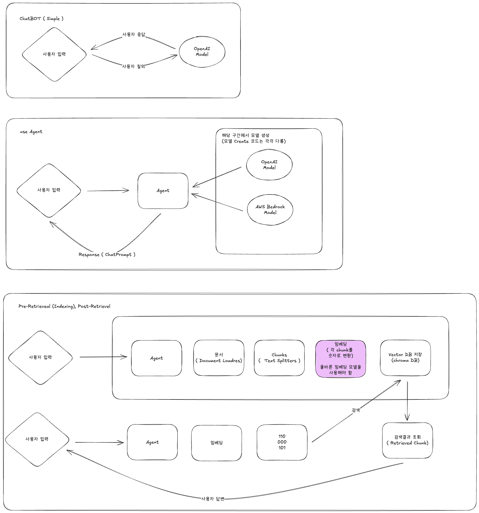

# Agent Study use TS



## Tools

### Agent

- Single Agent - LangChain.js
- Multi Agent - LangGraph.js

### VectorDB

- Production - Pinecone / AWS OpenSearch
- Local / Test - Chroma

```sh
npm install chromadb @chroma-core/default-embed
```

## Docs

[Langchain](./docs/langchain.md)

## Reference

- <a href="https://docs.langchain.com/oss/javascript/integrations/chat"> LangChain Model List </a>
- <a href="https://docs.trychroma.com/docs/overview/getting-started"> Chroma DB Client </a>
